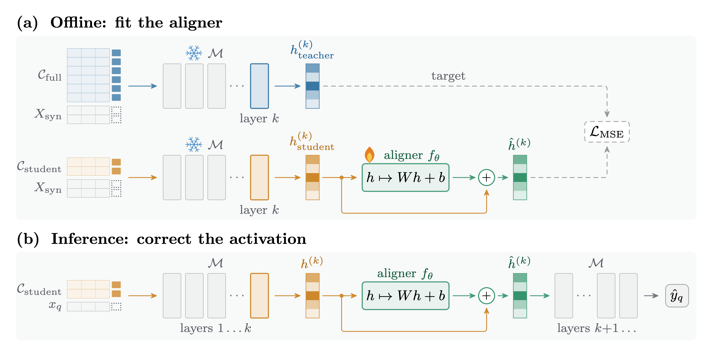

<h1 align="center">Closing the Context Gap</h1>
<p align="center"><b>Activation Alignment for Tabular In-Context Learning</b></p>

<p align="center">
  
  <a href="https://yoel-zeldes.github.io/tabalign/"></a>
</p>

<p align="center">
  
</p>

## TL;DR

Tabular foundation models like **TabPFN-3** and **TabFM** learn in-context. They are transformers that attend
over the labeled training set, so unlike classical models such as XGBoost, they never decouple training from inference: every prediction
carries the whole training set through the forward pass, at a cost quadratic in context length. Caching the
intermediate key-value states avoids the recompute, but only by trading it for device memory that grows with the
context. Shrinking the context dodges both costs, and hurts accuracy.

**Activation alignment** buys back a significant portion of that accuracy without enlarging the context. We use the full dataset
*once*, offline, to teach a **linear aligner** how a small-context "student" should have represented its inputs
had it seen the entire dataset like the "teacher". At inference the aligner is applied on top of the student's intermediate layer activations, and the context stays small.

- Trains on **unlabeled synthetic queries**, so no extra labels are needed.
- The aligner itself trains in **seconds to minutes on a CPU**. No fine-tuning the foundation model, whose weights stay frozen.
- Costs **one matrix multiply** at inference. Context size stays small, and so does the inference cost.

> **[Explore the results interactively](https://yoel-zeldes.github.io/tabalign/)**

## Results

38 TabArena classification datasets, 5 repeats, ROC-AUC (binary) and negative log-loss (multiclass).

| | TabPFN-3 | TabFM |
| :--- | :---: | :---: |
| Win rate vs. unaligned student | **82.2%** | **79.8%** |
| Win rate vs. XGBoost *trained on 100% of the data* | **81.1%** | **80.3%** |
| Median teacher gap closed at a 10% context budget | **48.3%** | **44.7%** |
| Average rank (aligned / unaligned / XGBoost) | **1.37** / 2.19 / 2.44 | **1.40** / 2.13 / 2.47 |

All win rates are significant at $p < 0.0001$ (two-sided paired Wilcoxon signed-rank test across datasets).

**Data amplification.** At a 10% context budget the aligned student matches an unaligned student given
roughly **two to four times** as many labeled examples.

## How it works

Let $\mathcal{M}$ be a frozen tabular foundation model. A **teacher** sees the full context
$`\mathcal{C}_{\text{full}}`$; a **student** sees a stratified subset of size
$`N_{\text{student}} = \lfloor \alpha \cdot N_{\text{full}} \rfloor`$. Both run the same weights, so they differ
only in what their intermediate activations encode.

| Stage | Script | What happens |
| :--- | :--- | :--- |
| 1. Synthesize queries | `create_synthetic_dataset.py` | Sample 1,000 unlabeled queries $`X_{\text{syn}}`$ from the joint feature distribution using TabPFN's generative mode. No labels involved. |
| 2. Extract activations | `extract_activations.py` | Push $`X_{\text{syn}}`$ through $\mathcal{M}$ twice, once under the teacher context and once under the student context, hooking layer $k$. |
| 3. Fit the aligner | `train_activation_aligner.py` | Fit $`f_\theta(h) = Wh + b`$ on the resulting activation pairs with MSE loss. |
| 4. Align at inference | `evaluate_aligned_student.py` | Register the hook on real test data and replace the layer-$`k`$ activation with $`h + f_\theta(h)`$. |

**Residual parameterization.** The aligner predicts the *correction* rather than the target:

```math
\mathcal{L} = \frac{1}{N_{\text{syn}}} \sum_{i=1}^{N_{\text{syn}}} \left\| f_\theta\!\left(h_{\text{student},i}^{(k)}\right) - \left(h_{\text{teacher},i}^{(k)} - h_{\text{student},i}^{(k)}\right) \right\|_2^2
```

Weights start near zero, so the aligner begins as approximately a no-op and only learns to move activations where it helps.

## Quickstart

Requires Python 3.13.

```bash
python -m venv venv
./venv/bin/python -m pip install -r requirements.txt
```

### Model access

TabPFN-3 weights are license-gated. The first run opens a browser so you can log in at
[ux.priorlabs.ai](https://ux.priorlabs.ai) and accept the license.

TabFM weights ([`google/tabfm-1.0.0-pytorch`](https://huggingface.co/google/tabfm-1.0.0-pytorch),
non-commercial license) are not gated, so no authentication is required.

### Local runs

Run the full pipeline on a single dataset to see it end to end:

```bash
./venv/bin/python main.py \
    --model tabpfn \
    --dataset tabarena/diabetes \
    --student_n 0.1 \
    --n_repeats 1
```

This synthesizes queries, extracts teacher and student activations, fits the aligner, and evaluates the aligned
student against the unaligned student, the full-context teacher, and XGBoost. Intermediate artifacts are cached
under `results/`, so re-runs are cheap.

### Useful flags

| Flag | Meaning | Default |
| :--- | :--- | :--- |
| `--model` | `tabpfn` or `tabfm` | `tabpfn` |
| `--dataset` | Dataset name(s), or `tabarena` for all 38 | `tabarena` |
| `--student_n` | Context budgets, as fractions in $(0, 1)$ or absolute counts | `0.1 ... 0.9` |
| `--layers` | Layer indices to hook | `23` (final layer) |
| `--n_samples` | Synthetic queries used to fit the aligner | `1000` |
| `--n_repeats` | OpenML split repeats | `1` |
| `--n_estimators` | Ensemble members | `8` (TabPFN) / `1` (TabFM) |
| `--lr` | Aligner learning rate | `1e-3` (TabPFN) / `1e-4` (TabFM) |

## Reproducing the paper

`create_figures.py` builds every figure and table. It reads **only from the cache** and silently skips
`(dataset, student_n, repeat)` combinations it cannot find, so run the sweep first or you will get
partial plots with no error.

```bash
./venv/bin/python create_figures.py \
    --model tabpfn tabfm \
    --dataset tabarena \
    --layer 23 \
    --student-n 0.1 0.2 0.3 0.4 0.5 \
    --n-repeats 5 \
    --output paper/figures
```

| Output | Content |
| :--- | :--- |
| `win_rate_bar_chart.png` | Win rates vs. the unaligned student and full-data XGBoost, with Wilcoxon annotations |
| `scaling_curves.png` | Sample efficiency $`E_\alpha`$ and share of the teacher gap closed |
| `avg_rank_histogram.png` | 3-way average ranking against the baseline student and XGBoost |
| `sample_efficiency_table.tex` | Per-dataset $`E_\alpha`$ across $`\alpha \in \{0.1, \dots, 0.9\}`$ |

## Running on Modal

The full sweep is 38 datasets x 9 context budgets x 5 repeats. [Modal](https://modal.com) fans this out so that
each `(dataset, student_n, repeat, layer)` combination runs as its own container, with a persistent Volume
(`tabular-cache`) holding the joblib cache, model weights, and OpenML downloads.

```bash
# One-time authentication
./venv/bin/python -m modal setup

# Smoke test
./venv/bin/python -m modal run main_modal.py::sweep \
    --dataset tabarena/diabetes --student-n 0.1 --n-repeats 1

# Full sweep, detached so you can close your laptop
./venv/bin/python -m modal run --detach main_modal.py::sweep \
    --dataset tabarena \
    --student-n "0.1 0.2 0.3 0.4 0.5 0.6 0.7 0.8 0.9" \
    --layers 23 \
    --n-repeats 5
```

`sweep` takes the same options as `main.py` with dashes instead of underscores. Multi-value options accept either
quoted spaces (`--layers "1 2"`) or commas (`--layers 1,2`).

```bash
./venv/bin/python -m modal app list          # find your app id
./venv/bin/python -m modal app logs <app-id> # stream logs
./venv/bin/python download_results.py        # pull results back into ./results in case you want to continue locally
```

## Repository layout

| Path | Role |
| :--- | :--- |
| `main.py` | Local sweep over datasets and context budgets |
| `main_modal.py` | Same sweep, fanned out across Modal containers |
| `create_synthetic_dataset.py` | Unlabeled synthetic query generation |
| `extract_activations.py` | Forward-hook activation capture for teacher and student |
| `train_activation_aligner.py` | Aligner training |
| `evaluate_aligned_student.py` | Inference-time hook injection and metric computation |
| `train_xgboost.py` | XGBoost baseline |
| `create_figures.py` | Paper figures, tables, and statistical tests |
| `download_results.py` | Sync results from the Modal Volume |
| `model_utils.py`, `data_utils.py`, `xgboost_utils.py` | Model wrappers, TabArena loading, baseline helpers |
| `cache_utils.py`, `cli_utils.py`, `consts.py`, `utils.py` | Caching, CLI parsing, dataset registry, shared helpers |

## Citation

A link to the paper will be available once it is published.

```bibtex
@misc{zeldes2026tabalign,
  title  = {Closing the Context Gap: Activation Alignment for Tabular In-Context Learning},
  author = {Zeldes, Yoel},
  year   = {2026},
  note   = {Unpublished manuscript},
  url    = {https://yoel-zeldes.github.io/tabalign/}
}
```

## Author

**Yoel Zeldes** - [LinkedIn](https://www.linkedin.com/in/yoelzeldes/)
